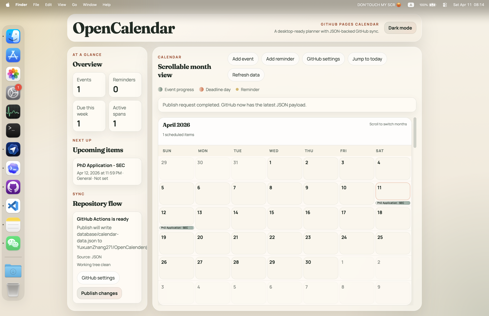

# OpenCalender

OpenCalender 是一个可直接部署到 GitHub Pages 的轻量日历网页应用。它以 `database/calendar-data.json` 作为唯一数据源，在浏览器中编辑事件和提醒，并可选择把变更发布回 GitHub 仓库。



## 现在的代码结构

- `web_ui/index.html`: 页面结构
- `web_ui/style.css`: 页面样式
- `web_ui/main.mjs`: 前端入口与状态编排
- `web_ui/js/config.mjs`: 配置与常量
- `web_ui/js/data.mjs`: 数据加载、标准化、本地草稿存储
- `web_ui/js/render.mjs`: 日历、统计、即将到来列表渲染
- `web_ui/js/editor.mjs`: 事件 / 提醒 / GitHub 设置弹窗逻辑
- `web_ui/js/github.mjs`: 发布到 GitHub 的逻辑
- `web_ui/js/utils.mjs`: 日期、主题、弹窗等通用工具
- `database/calendar-data.json`: 日历数据
- `.github/workflows/calendar-data-sync.yml`: GitHub Actions 同步工作流
- `scripts/sync-calendar-data.mjs`: 工作流使用的数据校验与写入脚本

## 本次整理

- 移除了旧的 CSV 兼容层，统一使用 JSON 作为唯一数据源
- 删除了不再需要的 `database/events.csv`、`database/reminders.csv` 和旧的 `web_ui/README.md`
- 把原本过大的 `web_ui/script.js` 拆成多个职责清晰的模块
- 清理了默认配置，避免把仓库归属信息硬编码到前端配置里

## 使用方式

1. 直接打开 GitHub Pages 上的 `web_ui/`
2. 页面会读取 `database/calendar-data.json`
3. 在页面中新增、编辑或删除事件和提醒
4. 保存后先写入浏览器本地草稿
5. 点击 `Publish changes`，通过 GitHub Actions 或 Contents API 发布 JSON 更新

## 本地预览

如果直接双击 HTML，浏览器可能因为 `fetch` 限制而无法读取 JSON。建议在仓库根目录启动一个静态服务器，例如：

```bash
python3 -m http.server 8000
```

然后访问：

```text
http://localhost:8000/web_ui/
```

## GitHub 发布

默认发布模式是 `GitHub Actions`：

1. 在仓库设置里开启 GitHub Actions
2. 给 workflow 打开 `Read and write permissions`
3. 创建一个只对目标仓库生效的 fine-grained PAT
4. 在网页里的 `GitHub settings` 中填写 `owner`、`repo`、`branch`、`dataPath` 和 `token`

工作流会调用 `scripts/sync-calendar-data.mjs`，校验并写入 `database/calendar-data.json`，随后自动提交到目标分支。
