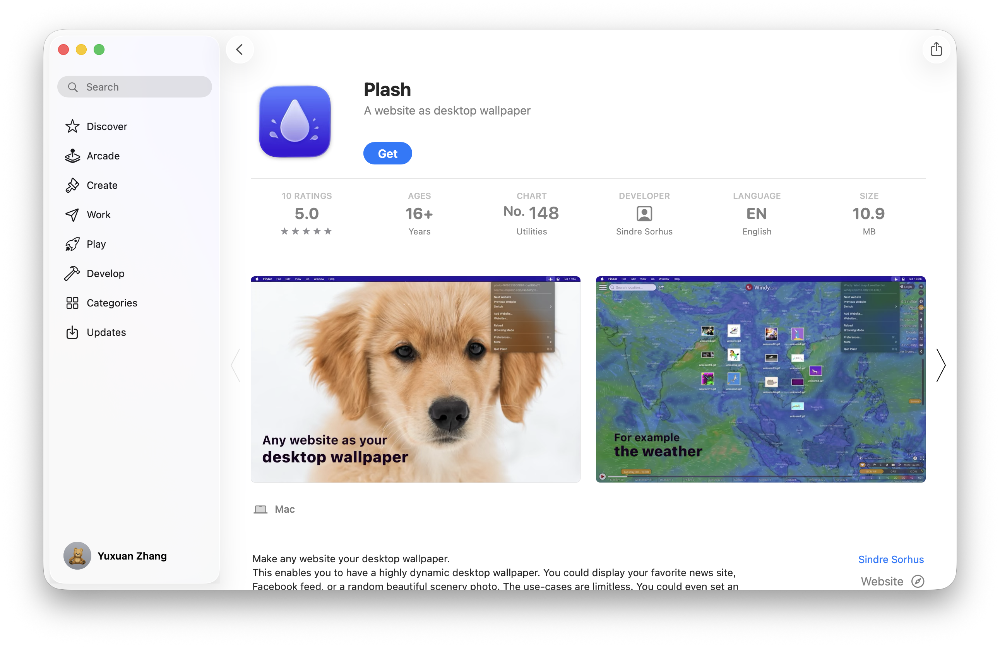

# OpenCalender
This is a automatic pipeline coded and handled by Codex. You can deploy it as your personal calender desktop!

- [OpenCalender](#opencalender)
  - [Preparation](#preparation)
    - [Plash](#plash)
  - [Data Flow](#data-flow)
  - [Editing And Sync](#editing-and-sync)
  - [Local Validation](#local-validation)
  - [Documentation](#documentation)

## Preparation
### Plash
To deploy your calender website as your desktop, you can install `Plash` from App Store, developed by [Sindre Sorhus 🦄](https://sindresorhus.com). 


## Data Flow
The calendar now uses `database/calendar-data.json` as the primary data source.

- `web_ui/` reads JSON directly and keeps edits in a browser-local draft first.
- `GitHub Actions` mode sends the JSON payload to `.github/workflows/calendar-data-sync.yml`, and the workflow validates then commits the update.
- `Contents API` mode skips Actions and writes the JSON file directly through the GitHub contents endpoint.
- Legacy CSV files are still present as fallback seed data, but JSON is the source of truth moving forward.

## Editing And Sync
Open the page, edit an event or reminder, then click `Publish changes`.

- `GitHub settings` are stored in browser `localStorage`, not in the repository.
- The default repository path is `database/calendar-data.json`.
- For personal use, `GitHub Actions` mode is recommended because the workflow performs the commit inside GitHub after the browser dispatches the payload.

## Local Validation
You can validate the JSON payload structure locally with:

```bash
node scripts/sync-calendar-data.mjs --validate --file database/calendar-data.json
```

## Documentation
1. Open the GitHub Pages site at `https://yuxuanzhang271.github.io/OpenCalender/web_ui/`.
2. Click `GitHub settings` in the left `Repository flow` card, then fill in:
   `owner=YuxuanZhang271`, `repo=OpenCalender`, `branch=main`, `dataPath=database/calendar-data.json`, `commitMode=actions`, `dispatchEventType=calendar_data_sync`, and your PAT.
3. Click `Add event` or `Add reminder` to create items. Existing items can be edited by clicking them in the calendar or in `Upcoming items`.
4. Saving only updates the browser-local draft first. Nothing is written to GitHub until you click `Publish changes`.
5. `Jump to today` scrolls to the current month, and `Refresh data` reloads repository data. If you have unsaved local draft changes, the page will ask whether to discard them.
6. Data is stored in `database/calendar-data.json`. The CSV files remain as empty compatibility files and are no longer the primary collaboration format.
